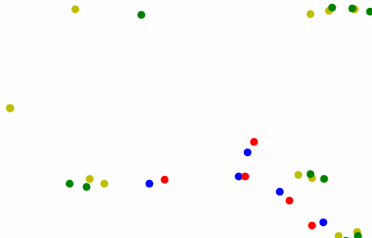

# Simultaneous Localization And Mapping

*Date: September 2018*

This repository holds my python implementation of a Simultaneous Localization And Mapping (SLAM) algorithm.

### Introduction

In order to drive autonomous vehicles even when no GPS data is available, e.g. in indoor spaces, [Simultaneous Localization And Mapping (SLAM)](https://en.wikipedia.org/wiki/Simultaneous_localization_and_mapping) algorithms can be used to pilot (fleets of) vehicles.

### Getting started

1. Clone the repo

2. Create and activate a virtual python 2 environment.

3. Run the code:

    python slam.py

### Demo

After running the code, you should get an environment like this one:

On this demo environment:
 
 - light green dots: true location of reference points (obstacles)
 - dark green dots: estimated location of reference points (obstacles)

 - red: true location of vehicles
 - blue: estimated location of vehicles
